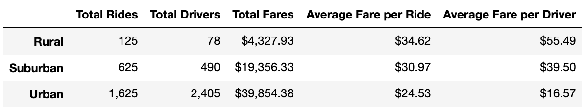
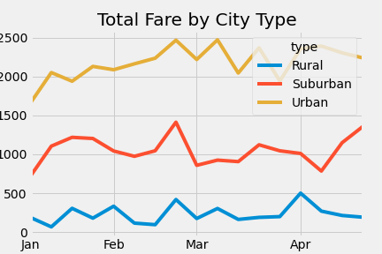

# PyBer_Analysis

## Overview of the analysis
We have been asked by PyBer, a ride-sharing app company valued at $2.3 billion, to analyze all the rideshare data from January to early May of 2019. We started off by creating a summary DataFrame of the ride-sharing data by city type. Then, using the knowledge of Pandas and Matplotlib to create a multiple-line graph that shows the total weekly fares for each city type. After the completion of the analysis, we were asked to provide a written report that summarizes how the data differs by city type and how those differences can be used by decision-makers at PyBer.

## Resources
Data Source: city_data.csv and ride_data.csv
Software: Python 3.7.2, Jupyter Notebook

## Results
After analyzing the data from three different city types (rural, suburban, and urban), we see that urban city type has the highest total number of rides with 1,625 total rides then suburban with 625 total rides, and rural with only 125 total rides. However, rural city type has the highest average fare per ride and the highest average fare per driver. Urban city type, on the other hand, has the lowest average fare per ride and lowest average fare per driver. Suburban city type's average fares per ride and per driver are in between the urban and rural's averages. Due to high volume, urban city type still generate the highest revenue then suburban then rural even though urban city type has the lowest average fare per ride and average fare per driver.

Per the line chart visualization below, we can see that the total fare by city type ranked from urban being the highest, then suburban in the middle, and rural being the lowest. There is a total fare spike at the end of February for all city types. Then another spike in the beginning of April for urban and rural cities while the total fare declined in suburban cities. However, we can see that total fare in suburban area had a spike again towards mid April to May while we see declining in total fare for urban and rural cities.

## Summary 
### Three business recommendations to the CEO for addressing any disparities among the city types. 
* 1. Based on the analysis, we can see that urban city drivers earn so much less than then suburban and rural city types. Our first recommendation would be to hire less driver in the urban areas to allow the drivers to earn more.
* 2. Based on the analysis, we can see that the fare average fare in rural area is much higher than other areas due to low total driver to total ride ratio. We would suggest hiring more driver in the rural area to drive the fare price down. Lower fare will increase the incentive to use rideshare services.
* 3. Based on the line chart, we would suggest that PyBer further analyze the period where the total fares have spiked. That way, PyBer would be able to determine how much more driver to hire to meet higher demand during the peak periods in each city types.
